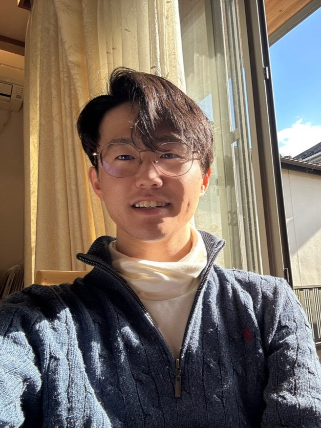

## 👋 Hi, I'm Shun

Computer science student focusing on **Cybersecurity Research**.

- 🔐 Researching **malware analysis, IoT security, and threat observation**
- 🧠 Interested in **security research and OSINT**
- 🏢 Research intern at **NTT DATA Institute of Management Consulting**

 

## 🔬 Research Interests

- Malware analysis
- IoT security
- Threat intelligence / OSINT
- Security data analysis

 

## 🚀 Projects

**IoT Malware Analysis Lab**  
Reverse engineering firmware and observing malware activity on IoT devices.

 

## 🌱 Skills

 

## 📊 GitHub Stats

 
  
  

