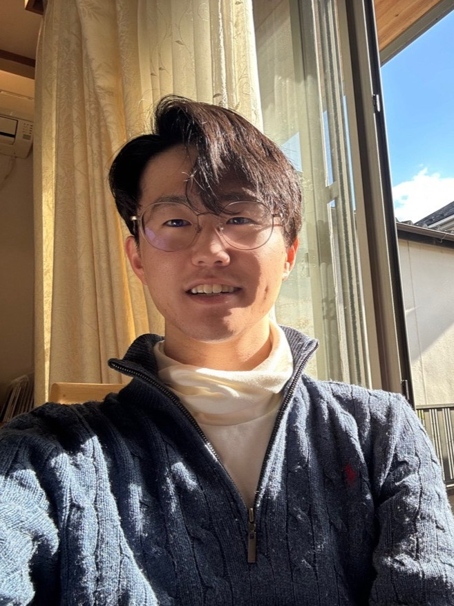

<div align="center">


# Shun　Ikeda

**Computer science student · building and leading product teams**

`travel platforms` · `regional revitalisation` · `cybersecurity research`

   


</div>

---

## 👋 About

<table>
<tr>
<td valign="top">

Computer science student. Most of what I build is aimed at **travel and regional revitalisation** — getting visitors to the places ordinary tourism skips, and giving smaller regions a reason to be visited. Alongside that I do **cybersecurity research** at university, on malware analysis and IoT security.

I also spend a lot of time on the organising side: running a programming circle, reviewing other people's PRs, and keeping the tooling a team of students actually depends on in working order.

```yaml
building:  Tabito — inbound travel platform
founded:   COCODOCO — travel by deduction
leading:   Lumos-Programming — YNU dev circle
research:  malware analysis · IoT security
intern at: NTT DATA Institute of Mgmt Consulting
stack:     TypeScript · Python · Java · C
ships on:  Next.js · Supabase · Stripe · Docker
```

</td>
<td width="295" valign="top">



</td>
</tr>
</table>

---

## 🧭 Tabito — inbound travel platform

**[tabito-travel-app](https://github.com/Tivo0921/tabito-travel-app)** · `Next.js 16` `React 19` `Supabase` `Stripe` `Tailwind v4`

A trip-planning and local-guide platform for visitors to Japan, and the largest thing I've built: **32 routes, 30 tables, 12 migrations.**

- 🌏 **Translation lives in the schema, not in string files.** Every content entity has a paired `*_translations` table — `spots`, `guides`, `magazine_articles`, `manner_tips`, `japanese_phrases`, `community_routes` — so ja / en / ko content is joined per row instead of being bolted on at render time.
- 🔐 **Row Level Security from the very first migration**, with separate policies for purchases and for guide registration. Not retrofitted later.
- 💳 **Stripe Checkout end to end** — session creation, webhook, and a verify route. `stripe_session_id` carries a `UNIQUE` constraint, so a replayed webhook cannot double-grant a purchase.
- 💬 **Threaded chat with read state** — `chat_threads` / `chat_messages` / `chat_reads`, plus SQL functions for thread summaries and marking threads read.
- 🎌 **An etiquette section for travellers**, categorised and translated like every other content type.

---

## 🏛 Organisations

Most of my work happens inside a team. These are the two I'm most invested in.

<table>
<tr>
<td width="50%" valign="top">

### 🗺️ [COCODOCO](https://github.com/cocodoco-jp) — founder

**Travel by deduction.** You're given a photograph, you work out where it was taken, and then you actually go there — as a game, with friends.

The point is to aim that foot traffic at places ordinary tourism never reaches: easing **overtourism** at the same overloaded landmarks, while giving smaller regions a reason to be visited at all.

Three pieces ship under the org:

- a **web service** for browsing and joining events
- an **admin app** in Dart/Flutter for running them
- a **LINE bot**, because that's where participants already are

I run the product side: the concept, how an event is shaped, and what gets built next.

*(Repositories are private.)*

</td>
<td width="50%" valign="top">

### 💡 [Lumos-Programming](https://github.com/Lumos-Programming) — organiser, org owner

The programming circle at **Yokohama National University**. I hold owner rights on the org and work on the internal platform **[lumos-web](https://github.com/Lumos-Programming/lumos-web)** — Next.js 16, NextAuth v5 over Discord OAuth, Firestore, Cloud Run.

**15 merged PRs across the org**, mostly on the operations side:

- the admin **member-management dashboard** and its filtering
- **Discord role synchronisation** — scoping it to year and faculty, branching per role type, handling alumni, and fixing a bug that deleted roles it didn't manage
- news publishing from the web UI, a birthday calendar, and `CODEOWNERS` so new members can find their way in

</td>
</tr>
</table>

---

## 🚀 Other Work

<table>
<tr>
<td width="50%" valign="top">

### 🐉 [ymon-web](https://github.com/Tivo0921/ymon-web) — YNU Monsters

`Next.js` · `Express` · `Supabase` · `Docker`

3v3 turn-based battler with **idempotent, race-safe matchmaking**, SPD-ordered turn resolution, and Dockerised local dev.

</td>
<td width="50%" valign="top">

### 🔍 [shinkan-search](https://github.com/Tivo0921/shinkan-search)

`TypeScript` · `Postgres`

Club-search app helping new students find the circle that actually fits them, on the Next.js App Router with Postgres-backed search.

</td>
</tr>
<tr>
<td width="50%" valign="top">

### 💾 [MyOS](https://github.com/Tivo0921/MyOS) & [projectC](https://github.com/Tivo0921/projectC)

`C`

An OS written from scratch (*ゼロからのOS自作入門*) and a sugoroku game in C — the low-level end of the résumé.

</td>
<td width="50%" valign="top">

### 🦈 [pull-shark-farm](https://github.com/Tivo0921/pull-shark-farm)

`Shell` · ⭐ 14

Automated PR harvesting, taken to its logical conclusion — **1024 merged PRs**, Pull Shark x4. A joke executed with unreasonable rigor.

</td>
</tr>
</table>

---

## 🔬 Workshop notes

Not original research — noted here only because the code is public.

For a workshop I re-ran an existing experimental design on a different dataset: **can an AI coding agent judge, from source alone, whether a piece of code is genuinely vulnerable?** The design comes from CVE-Bench. I swapped in [OWASP BenchmarkJava](https://owasp.org/www-project-benchmark/), which pairs real vulnerabilities with deliberate look-alikes that turn out to be safe, and varied how common vulnerabilities were in the bundle ([10 %](https://github.com/Tivo0921/owasp-benchmark-java-audit-vuln10) / [90 %](https://github.com/Tivo0921/owasp-benchmark-java-audit-vuln90)) to see what that does to an agent's judgement. The scripts that select cases, build the bundles and grade the JSON reports are [mine](https://github.com/Tivo0921/owasp-benchmark-audit-organizer); the research question and the evaluation framing are not.

> Wang et al. (2025). *CVE-Bench: Benchmarking LLM-based Software Engineering Agent's Ability to Repair Real-World CVE Vulnerabilities.* NAACL 2025. https://aclanthology.org/2025.naacl-long.212/

---

## 🛠 Tech

<div align="center">

**Languages & Runtime**


**Infrastructure & Tooling**


</div>

---

## 📊 Stats

<div align="center">


<sub>Cards served from my own <a href="https://github-readme-stats.shion.dev">github-readme-stats</a> instance.</sub>

</div>

<div align="center">


</div>
